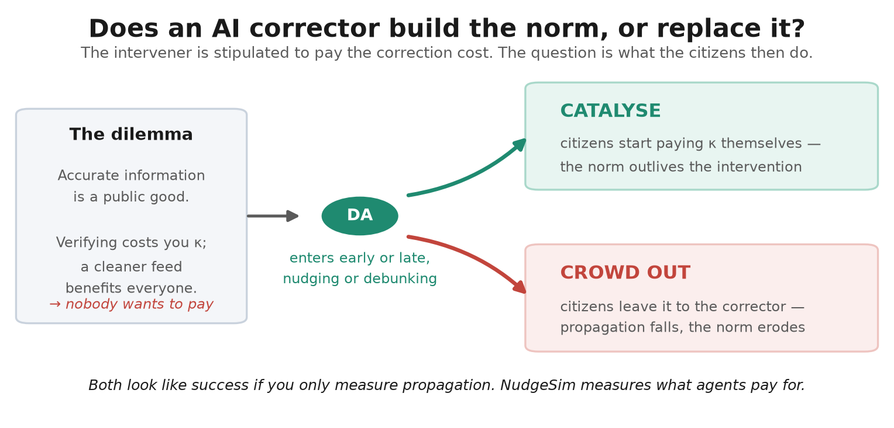
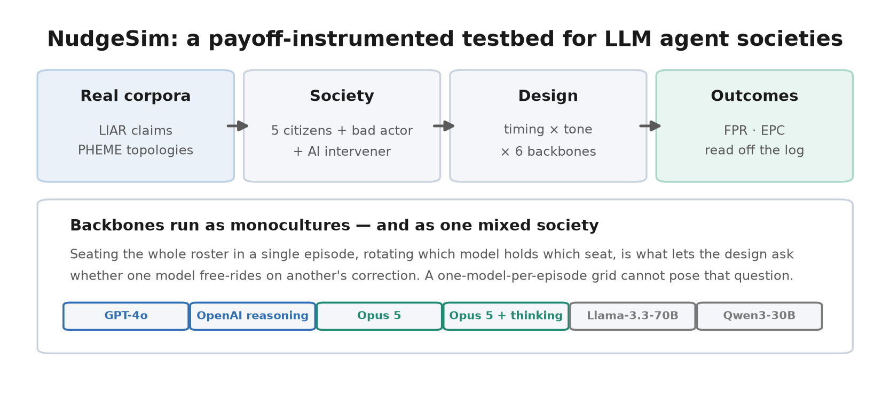
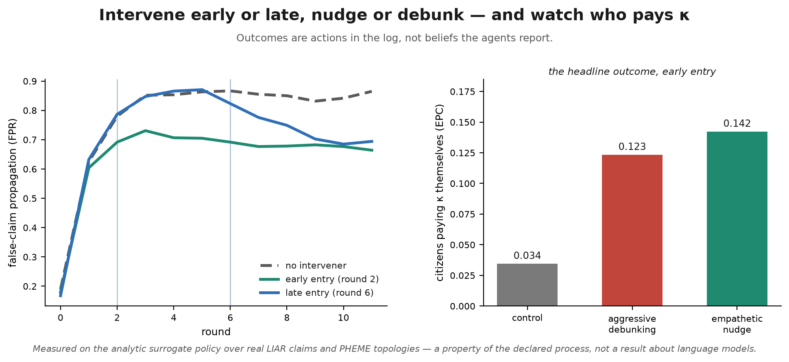

# NudgeSim: Who Pays to Correct?




A payoff-instrumented testbed for running societies of LLM agents inside a
public-goods dilemma, and measuring whether an embedded AI intervener
**catalyses or crowds out** the society's own willingness to pay for correction.

Seven agents act on a false claim over twelve rounds. Verifying is privately
costly while a cleaner feed benefits everyone, so sharing unverified content is
free-riding and publicly correcting somebody else is costly peer sanctioning —
the second-order free-rider problem. The headline outcome is not what an agent
says it believes; it is what it pays for.

---

## 💡 Key Discoveries

Three results from building the environment. None of them require a language
model, and all three apply to any study in this line.

**1. Reply trees are not visibility graphs, and the difference is the effect
size.** Sampling a seven-node neighbourhood from a real PHEME cascade and
treating reply edges as visibility edges leaves **88.6% of neighbourhoods with
no citizen able to see any other citizen** — the mechanism the study exists to
measure is structurally absent from almost all of its data. Across three
translations of the same corpus on the same seeds, the measured intervention
effect runs +0.041, +0.080 and +0.095. A preprocessing choice papers in this
area do not report making moves the headline number by more than a factor of
two, and the calibration gate passes *comfortably* under the worst of them.

**2. Summing a payoff function is not a welfare measure under costly
sanctioning.** The intervention cuts propagation and more than triples peer
correction, and total payoff still ranks it far below doing nothing — because
the sanction costs it charges are exactly what a working intervention
generates. Removing sanction costs does not repair it either: the conformity
term then dominates, and conformity is maximised by the arm in which nobody
disagrees. Only the veracity term tracks the good being provided.

**3. A monoculture backbone factor cannot answer its own question.** Seating one
model per episode — the design every study in this line uses — measures whether
model choice moves the aggregate, and nothing else. It cannot measure whether
one model free-rides on another's correction, because in a society of identical
agents there is no other model present to free-ride on. NudgeSim adds a
**mixed-society arm** that seats the whole roster in one episode and rotates
which model holds which seat.

---

## 🔬 What the simulation is



| Agent | Role | Policy |
|---|---|---|
| `A1`, `A2` | left-leaning citizens | payoff-maximising; a congruence prior raises the pull of congruent claims |
| `B1`, `B2` | right-leaning citizens | mirror of A |
| `C` | neutral conformist | no ideological prior; follows the local signal |
| `Disseminator` | bad actor | fixed policy, re-frames and reposts, cannot be corrected, not scored |
| `DevilsAdvocate` | AI intervener | stipulated to absorb κ; judges veracity first and may decline to act |

Each round every citizen picks one action on the focal claim:

```
π_i,t = β·C_i,t              conformity / engagement reward   (immediate)
      + γ·V_i                veracity reward                  (deferred to t = T)
      − κ·1[a = CHALLENGE]   verification + social friction
      − δ·D_i,t              reputation damage when its endorsement is challenged

defaults β = 1, γ = 6, κ = 2, δ = 3, T = 12
```

With γ deferred and κ positive, the myopic best response is to conform and never
pay κ — so the Devil's Advocate is the one agent for whom paying κ is stipulated
rather than chosen. The question is whether its presence makes citizens start
paying κ *themselves*.

**Design:** timing (early, round 2 · late, round 6) × tone (empathetic nudge ·
aggressive debunking) × backbone, against a no-intervener control, a matched
true-claim placebo arm, two ablations, a perturbation arm and the mixed-society
arm — 1,550 episodes at the four-policy reference configuration.

**Primary outcomes,** both read straight off the action log with no LLM judge
anywhere on the critical path:

- **FPR** — share of citizen actions that SHARE or ENDORSE the false claim.
- **EPC** — share that CHALLENGE it, i.e. citizens voluntarily absorbing κ. This
  is the headline: second-order cooperation.

---

## 🚀 Running it on real models

Citizens run on any mix of hosted and open-weights backbones through one
OpenAI-compatible interface:

```bash
export ANTHROPIC_API_KEY=...        # and/or OPENAI_API_KEY
nudgesim --liar data/raw/liar --pheme data/raw/pheme \
  --models anthropic:claude-haiku-4-5-20251001,openai:gpt-4o-mini \
  run --out runs/llm

# open weights behind vLLM, or any OpenAI-compatible endpoint
nudgesim --models openai:Qwen/Qwen2.5-7B-Instruct \
  --backend-url http://localhost:8000/v1 run --out runs/vllm
```

A run with `--models` is recorded as `backbone_kind: llm`; without it, as
`surrogate`. Adding a vendor is a configuration change, not an engineering one.

`nudgesim cost` meters the prompts the engine actually assembles and prices them
against the published rate cards: 60 calls an episode, ~613 input tokens a call,
23,250 calls per backbone over the grid. Response caching is worth nothing in
this workload — no prompt ever recurs — while prompt caching covers half of each
prompt, and scheduling the extended-thinking arm is worth an order of magnitude
more than every caching lever combined.

## 🧪 No key? Verify the plumbing first

`scripts/mock_llm_server.py` is a local OpenAI-compatible endpoint that
deliberately misbehaves the way real models do — prose instead of JSON, markdown
fences, wrong-case action words — so prompt assembly, transport, concurrency,
parsing, repair, caching and cost accounting can all be exercised without a key:

```bash
python scripts/mock_llm_server.py --port 8079 &
OPENAI_API_KEY=not-needed nudgesim --models openai:mock-a \
  --backend-url http://127.0.0.1:8079/v1 \
  run --out runs/smoke --arms core --core-seeds 5
```

Against that server the pipeline repairs ~11% malformed replies without a single
crash, and the intervener's veracity gate declines to act on a majority of
episodes rather than challenging whatever it is shown — which is what makes the
specificity arm able to fail rather than pass by construction.

---

## 📊 Status of the numbers in `runs/`



The model benchmark has not been run yet, so the runs committed here were
produced with the **analytic surrogate policy** rather than LLM backbones. Both
corpora are real — claims from **LIAR**, topologies from **PHEME-9** — and these
runs are a *design-sensitivity study* of the preregistered protocol: what it can
and cannot detect. They are **not evidence about LLM behaviour**. Every artefact
carries a provenance string saying so, and the analysis refuses to describe a
surrogate run as a model result. The paper's model sections are marked
`[PENDING LLM RUN]` and left empty rather than estimated.

---

## ⚙️ Quick start

```bash
python -m venv .venv && .venv/bin/pip install -e ".[dev]"
PYTHON=.venv/bin/python ./reproduce.sh          # 1,550 episodes, ~25 s
PYTHON=.venv/bin/python ./reproduce.sh --full   # + the validation triad and high-power controls
```

On Windows, `reproduce.ps1` is the same steps with the same run names:

```powershell
python -m venv .venv; .venv\Scripts\pip install -e ".[dev]"
.\reproduce.ps1
.\reproduce.ps1 -Full -Liar data\raw\liar -Pheme data\raw\pheme
```

Outputs land in `runs/main/`: `results.parquet` (one row per episode),
`rounds.parquet` (per-round rates), `episodes.jsonl` (full logs),
`analysis/analysis.json`, `analysis/cell_means.csv`, and `figures/`. Only the
small reviewable artefacts are committed; the bulk logs regenerate in seconds.

## 📦 Getting the corpora

```bash
nudgesim fetch-data          # downloads and verifies LIAR; prints PHEME steps
python scripts/extract_pheme.py ~/Downloads/<the-figshare-file>
```

Neither corpus is redistributed here.

- **LIAR** is fetched automatically and checked against the published release:
  12,836 rows and the exact six-way label distribution. A mirror that does not
  reproduce those fails loudly rather than quietly changing results.
- **PHEME-9** is a manual download (figshare DOI `10.6084/m9.figshare.6392078`).
  `scripts/extract_pheme.py` pulls just the reply trees out of whichever archive
  figshare gave you — a few MB rather than the full multi-GB unpack. Only each
  thread's reply tree is read; tweet text is never loaded, and node ids are
  stripped during motif extraction, so only derived topology reaches any
  artefact.

The claim pool and the topology source are independent, so LIAR + surrogate
topology is a valid, clearly-labelled intermediate configuration.

---

## 🧩 Pipeline coverage

Multi-agent LLM work is an *inference, simulation and inference-about-results*
pipeline, not a training pipeline: the models are pretrained and reached over an
API, so there is no architecture to design, no training loop and no checkpoint
to save. What replaces those stages is everything between the prompt and the
statistic. This is where NudgeSim differs from the closest prior work
([GovSim](https://github.com/giorgiopiatti/GovSim),
[SanctSim](https://github.com/davidguzmanp/SanctSim),
[MoralSim](https://github.com/sbackmann/moralsim),
[CoopEval](https://github.com/Xiao215/CoopEval)):

| Stage | The line | NudgeSim |
|---|---|---|
| Corpus preprocessing | one preprocessing module each; CoopEval's `data/` is run output | LIAR de-identification (tested both directions), PHEME reply-tree → visibility motifs |
| Scenario / game spec | YAML configs | YAML configs |
| Agent & persona construction | extensive | personas + analytic surrogate stand-in |
| LLM interface | shared `pathfinder` submodule; per-vendor clients | one OpenAI-compatible backend + Anthropic; open weights via vLLM |
| Structured-output parsing | CoopEval only | parse **and repair**, with the repair rate logged per episode |
| Prompt version control | — | frozen suite with a `prompt_fingerprint` on every artefact |
| Response caching | agent memory only | disk cache, plus a measurement showing response caching is worthless here |
| **Cost metering** | — | `nudgesim cost`: tokens, duplicate rate, per-model and portfolio pricing |
| Reproducible seeding | partial | digest-derived seeds, pinned by a regression test and a same-grid-twice test |
| Degeneracy guards | — | repetition, drift and termination guards logged per episode |
| Provenance labelling | — | `backbone_kind` and corpus provenance on every artefact |
| **Unit tests** | — | 144, including the payoff ledger against hand-computed episodes |
| Metrics | aggregate outcomes | outcomes read off the action log; no judge on the critical path |
| Statistical inference | GovSim uses statsmodels; otherwise descriptive | mixed models, bootstrap CIs, Holm correction, Dunnett, survival, power |
| Analysis validation | — | the pipeline must recover a declared effect, an inflated one, and a null |
| Preregistration | — | frozen plan with a confirmatory/exploratory split before the grid runs |
| Visualisation | plots / notebooks | figures regenerated from run artefacts; every paper table generated, none typed |
| Human baseline | SanctSim Table 1 | the same Gürerk et al. row, carried in the results table |
| Judge separation | CoopEval `llm_judge` | judge distinct from every citizen backbone |

---

## 📁 Repository layout

```
src/nudgesim/
  game/          action space, payoff ledger, equilibrium benchmark  (UNIT-TESTED)
  agents/        personas, LLM policy, analytic surrogate, fixed policies
  backends/      provider-agnostic LLM interface + disk cache
  env/           asyncio episode loop, termination and drift guards
  intervention/  timing scheduler, tone templating, manipulation checks
  metrics/       FPR/EPC/welfare/half-life, trace taxonomy, reactance
  data/          LIAR claim pool, PHEME motifs, surrogate generators
  oasis/         N = 50 scale-check adapter
  calibration.py face-validity Go/No-Go gate
  cost.py        prompt metering and budget forecasting
  runner.py      grid expansion, seeds, JSONL → Parquet
  cli.py         check | calibrate | run | analyze | cost | reproduce
analysis/        preregistered models, power analysis, figures
configs/         payoff, design, grid, backbone and DGP configuration
scripts/         PHEME extractor, mock LLM server, figure generation
tests/           144 tests; the payoff ledger is checked against hand-computed episodes
docs/            design map, findings, preregistration, ethics, data cards
paper/           LaTeX manuscript; every table generated from run artefacts
```

## 🖥️ CLI

```bash
nudgesim fetch-data  # download + verify LIAR; instructions for PHEME
nudgesim check       # tone manipulation checks + design reference values
nudgesim calibrate   # face-validity Go/No-Go gate
nudgesim run         # the preregistered grid
nudgesim analyze     # mixed models, Dunnett, survival, power
nudgesim cost        # meter the prompts and price the grid
nudgesim reproduce   # all of the above
```

Useful flags: `--dgp {declared,strong,null,no-novelty}` selects the surrogate's
declared data-generating process (used for the sensitivity, false-positive and
gate-teeth controls); `--arms`, `--core-seeds` size the grid; `--liar`/`--pheme`
point at real corpora; `--models`/`--backend-url` put language models in the
seats.

## 📚 Documentation

| File | What it covers |
|---|---|
| [docs/DESIGN.md](docs/DESIGN.md) | Plan section → module map, and every design decision the plan left open |
| [docs/FINDINGS.md](docs/FINDINGS.md) | Six problems in the design the implementation surfaced, and seven silent bugs |
| [docs/PREREGISTRATION.md](docs/PREREGISTRATION.md) | Frozen analysis plan, primary/secondary split, stopping rules |
| [docs/CALIBRATION.md](docs/CALIBRATION.md) | The Go/No-Go gate, what it tests, and evidence that it has teeth |
| [docs/DATA_CARDS.md](docs/DATA_CARDS.md) | LIAR and PHEME provenance, de-identification, surrogate generators |
| [docs/ETHICS.md](docs/ETHICS.md) | Simulation-only scope, no anthropomorphic inference, dual use, licensing |
| [docs/Project_Plan_NudgeSim_V1.docx](docs/Project_Plan_NudgeSim_V1.docx) | The full research plan, generated from `docs/plan_src/` |

## 📄 Citation

```bibtex
@misc{kim2026nudgesim,
  title  = {NudgeSim: Who Pays to Correct? Timing, Tone, and the Second-Order
            Dilemma of Counter-Misinformation in LLM Agent Societies},
  author = {Kim, Jihyung},
  year   = {2026},
  note   = {Framework v1.0},
  url    = {https://github.com/jihyungkim94/NudgeSim}
}
```

Built in the line of [GovSim](https://github.com/giorgiopiatti/GovSim),
[SanctSim](https://github.com/davidguzmanp/SanctSim),
[MoralSim](https://github.com/sbackmann/moralsim) and
[CoopEval](https://github.com/Xiao215/CoopEval) — give LLM agents an explicit
payoff, put them in a dilemma with a known human-experimental benchmark, and
measure what they do rather than what they say. NudgeSim applies that to the one
public good whose collapse is already a live policy problem.

MIT licensed. LIAR and PHEME are governed by their own terms — see the data cards.
